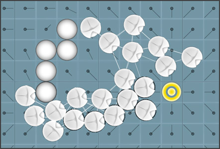

[Demo.](http://vonwolfehaus.github.io/flow-field/)

Based on [this TutsPlus tutorial](http://gamedev.tutsplus.com/tutorials/implementation/goal-based-vector-field-pathfinding/).

## Overview

Sometimes called flow fields, vector fields, wavefront expansion, brushfire, and so on. The idea is to use Dijkstra's algorithm to fill out a grid, starting from a single cell, with the distance from current cell to that original cell. On each cell we calculate a vector that points in the direction of the goal. As entities roll over a cell, we simply apply that vector to the entity's velocity.

This makes pathfinding very large numbers of objects very efficient. However, there are some problems such as local optima. I hoped to solve local optima with flocking--if one entity gets stuck, it will come out of it by following its neighbors out (who did not get stuck).

It didn't work as well as I hoped. I didn't spend enough time placing proper weights on the flocking rules, but just using collision resolution resulted in smoother pathing. Anyway, that's what experiments are for.

# Details

After playing [Planetary Annihilation](http://www.uberent.com/pa/) and witnessing how well [their flow fields](http://youtu.be/5Qyl7h7D1Q8?t=24m30s) worked for pathfinding tons of units at once while maintaining excellent performance, I was interested in trying it myself&#8211;unit movement in RTS games is a huge problem field with a lot of solutions. So I found [this article](http://gamedev.tutsplus.com/tutorials/implementation/goal-based-vector-field-pathfinding/) on the subject and proceeded to hack it out in JavaScript.

  <a href="http://vonwolfehaus.github.io/flow-field/" >View demo</a>

Besides trying out this goal-based vector field pathfinding, I also wanted to use this opportunity to revisit **steering behaviors** and play with a **componentized base**. I&#8217;ll go over each aspect in turn to talk about what I discovered.

  <a href="https://github.com/vonWolfehaus/FlowField" >View source on GitHub</a>

## Anatomy of a flow field

The idea is to use Dijkstra&#8217;s algorithm to fill out a grid, starting from a single cell (the goal), with the distance from current cell to that goal cell. On each cell we calculate a vector (direction) derived from the distance value. As entities roll over a cell, we simply apply that vector to the entity&#8217;s velocity. That&#8217;s all there is to it!

How it actually plays out is fascinating. By simply subtracting the weight of neighboring cells with each other (`left - right`, `top - bottom`), you get an angle that will point around obstacles if they exist nearby, as well as point directly at the goal itself if it&#8217;s in plain sight (see this post&#8217;s header image for a visual). So calculation is extremely fast, and it works really well!

This makes pathfinding very large numbers of objects very efficient. Another huge bonus is that it makes pathfinding around dynamic objects efficient and easy. With traditional pathfinding like A*, you&#8217;d have to recalculate the path for dynamic terrain, but you&#8217;d also have to do special modifications to the steering behaviors to avoid dynamic objects. With a flow field, you simply mark the cells occupied by these dynamic obstacles with negative values&#8211;a much cheaper operation, certainly.

However, there are some problems too. I hoped to solve the local optima problem in particular with flocking&#8211;if one entity gets stuck, it will come out of it by following its neighbors out (who did not get stuck since they were not occupying the same cell due to collision detection). That was the theory anyway&#8230;

#### Performance concerns

The trade-off is that the vector grid takes up a ton of memory. This is ok for desktop and laptop computers, but not for anything smaller. In addition, the sheer number of calculations makes this technique somewhat troublesome. So, severe optimizations have to be made and while they&#8217;re not hard to do, it does take a bit of grunt work to pull off.

For example, to help with memory you can re-use grid cells and only create them when absolutely necessary at run-time. If a path is no longer used, toss those cells into the &#8220;free&#8221; list to reuse for a different query. You can also use one data structure per cell, but keeping an array of vectors inside of it so that multiple fields can exist in the same space simultaneously without creating multiple instances of the grid cell class.

For keeping the number of calculations low, you can further partition the grid so that you only calculate the cells that the entities will actually run into (as opposed to the whole map). But figuring out which cells to use like this requires a different pathfinding algorithm to be used, and ran on a different, lower-fidelity grid. Additionally, you can compact large fields that carry the same value into a single cell reference&#8211;as you can see in the image at top, there are a lot of duplicate vectors everywhere, screaming to be optimized.

## Flocking

As you can see for yourself in the demo, flocking doesn&#8217;t make it any better. This is sad news, since flocking is a very powerful tool for keeping unit movement realistic and even emergent. I think it can be made to work much better if the algorithms are tweaked a bit (and weighted), but I&#8217;m sad that what I _did_ have wasn&#8217;t good enough to improve the solution&#8211;it actually made it a little worse.

However, I believe the problem is not in the steering behavior itself as much as it is with my particular implementation. The flocking algorithm is fragile, yes, but I think the fact that I use radial collision for obstacles kind of cheats the system a bit&#8211;when one hits, it forces the entity into a certain direction, thus &#8220;solving&#8221; the indirection problem that local optima creates. This means that collision detection is all that is necessary, so the flocking only threw it off the flow. That, and I have no angular velocity limit which is a key part of steering behaviors, further screwing things up. This is called &#8220;lazy science&#8221;.

## Entity Component System

This was a good time to try the component-based approach to game engine architecture. Popular engines like [Unity3D](http://unity3d.com/) make excellent use of it to great effect&#8211;Unity3D is arguably the most flexible engine on the market today, and an absolute pleasure to work with. _(My implementation is not complete, and quite shallow since I&#8217;m merely playing with the idea&#8211;I still loop through all entities directly, instead of organizing and looping through component lists&#8211;a &#8220;system&#8221;&#8211;like a proper component engine would do.)_ Components are a particularly good choice for HTML5 games, since it works to JavaScript&#8217;s strengths, such as its object-based foundation and its completely dynamic nature.

#### Overview

In entity component systems, composition is used instead of inheritance. This is all kinds of excellent. There is no monolithic base object (or any monolithic classes at all!), nor awkward hierarchies that don&#8217;t satisfy every design requirement. I highly recommend researching this architecture if you&#8217;re not already familiar with it.

There is some weirdness when it comes to the details of how each aspect works with the others, and everyone does it differently apparently. Eventually I decided on a system where each component has a reference to its parent object, and it&#8217;s instantiated by passing in that parent as well as (optionally) any settings unique to that component.

Communication between components is done directly by accessing another component through its parent. In order to avoid errors, the component will attach any prerequisite components to its parent if it doesn&#8217;t already exist (on a per-component basis, in its init function). This results in fast execution since there&#8217;s no unnecessary layers of abstraction that the CPU would have to work through otherwise.

#### Further details

Often times in games you have entities that require special behaviors for special situations. To accommodate this, the entity can listen to a component&#8217;s [Signals](https://github.com/millermedeiros/js-signals), if any exist. For example, a Health component will dispatch a signal when its amount goes below 0, or another when it reaches its max amount again. The same goes for collider components: a signal is dispatched when a collision occurs (by the collision broadphase system), passing in the object it collided with and the manifold of the collision as parameters of the callback. The entity can listen for these signals, or its other components can as well.

After I decided on this, the whole concept fell into place and made everything much more manageable, flexible, and even fun to build with. I will definitely going balls to the wall with component systems in future projects!

## Conclusion

**Ultimately**, I think going with steering behaviors and doing a single A* calculation for a leader of the pack gets you better movement behavior for a lot less memory and CPU time. **Conversely**, this method can be augmented with more interesting features such as _potential fields_ which would make the flow field much more useful&#8230; but again, only with what seems like an unnecessary amount of work, and still at a loss of performance if not refactored to hell and back. There are alternative techniques that I think are more efficient but likely just as effective (if not more so), such as _nav mesh_.

Keep in mind that I did not dig into this experiment too deep, as I was merely curious about the broader implications and other implementation details (_eg_ the component system). Honestly, I think my code is a poor indicator of how a production-quality system would perform, both in terms of CPU as well as the AI&#8217;s aesthetic aspect.

With that said, the code is simple enough, so please have a look and play around with it yourself. If you found a superior solution, feel free to submit a pull request&#8211;I&#8217;d really appreciate it! I want this solution to work and interested in learning more about it, but I need to move on to other projects. Thanks!
